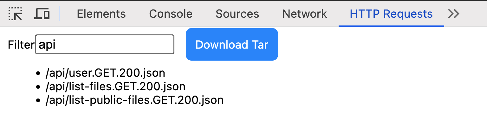

# DevTools extension for exporting HTTP requests as Tar

## Filename Convention
- path
- method
- response status
- extension based on the `Content-Type`



## Setup
```npm install```

## License
ISC
